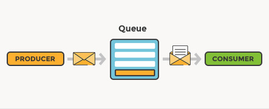
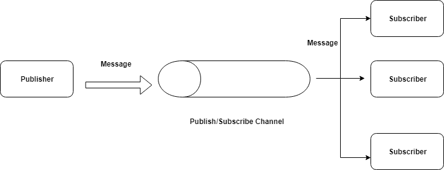
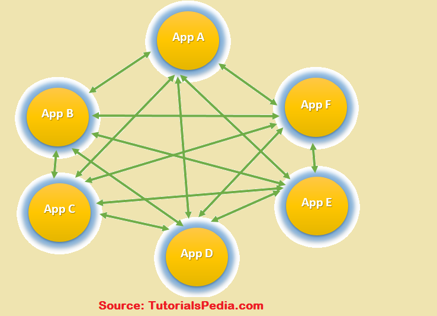
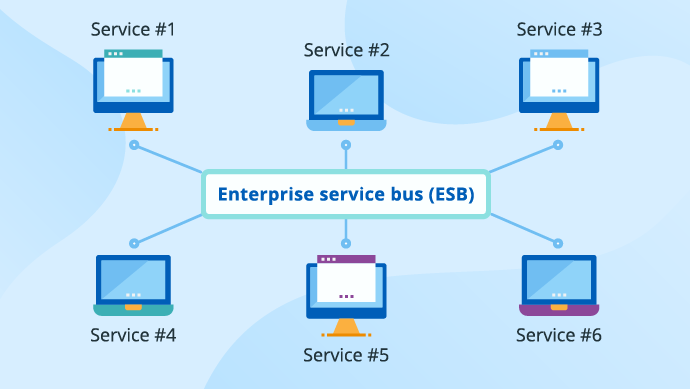

# 
                       <u>**MESSAGING QUEUE**</u>

# INTRODUCTION

    Messaging Queue-
    Messaging Queue is storage for asynchronous communication between different parts of a system.
    Those parts can also be referred to as "Producers" and "Consumers".
    There are several producers(request for service) and several consumers(processes request). Messaging Queue provides storage for the request made by the producer and consumers fetch the message in a sequence of FIFO and processes the request accordingly.
    Enterprise Service Bus(ESB)-
    ESB provides communication cahnnel between all the systems present in a system.
    It provides additional features to the communication system by adding various feaure to communicate between each/every system.

  

     

# TABLE OF CONTENT

  >-    Synchronous and Asynchronous communication.
  >-    Messaging Queue
  >-    Message Queue used models
  >-    Why Message queue is used
  >-    Popular tools
  >-    Enterprise message bus

     

## 1. *Synchronous and Asynchronous communication*

   To understand MQ we first need to know what is "Synchronous and Asynchronous communication"?
  - ###  Synchronous Communication-
      It is a communication when the producer and the consumer are in sync. 
      This means one who is requesting service(Producer) and the one who is receiving the request(Consumer) are responding at the same instance. 
      Example- 
      Tow or more people communicating through mobile phone.
  - ### Asynchronous communication-
      It is a communication in which the **Producer** and the **Consumer** do not necessarily need to be present at the same instance to respond to the request. 
      Example- 
      Text message send to a friend who is not connected to a network but receives a message when connected to the network.

    

## 2. *Messaging Queue*

  Messaging Queue allows different parts of a system(Producer and Consumer) to communicate Asynchronously.
  MQ is a sequential line of data block which has data structure and memory to store requests. These requests are messages and this is called a message queue. Message queue acts as a medium to communicate between the parts of a system.

  Simply put, MQ is a storage where producer sends their request, that request is stored at the tail(end) of the queue and the consumer takes the messages from the head(Start) of the queue and processes accordingly.
  

  **WORKING**
- Producer makes the request as message.
- Those messages go at the end of a queue as it is a FIFO storage device(Queue).
- Consumer fetches the message. 
- Each message is processed only once by a single consumer.
- And the request is carried out according to the message.

  

    

## 3. *Message Queue used models*
    There are two models in which message queues are used.
  - #### **One-To-One model.** 
  - #### **Pub/Sub model.** 
  1. One-To-One model- 
    In One-To-One model a single request is processed by a **_Single Customer_**. 
    If the number of requests increases even then a single request is processed by a **_Single Customer_**. 
     
    Example- 
    Sending an e-mail to a friend.That e-mail is processed by a single consumer and only once.
  

    

  

  2. Pub/Sub model- 
    Pub/Sub model also known as Publish Subscriber model. 
    In this model, a single message is decoupled and a copy of the message is sent to **_many subscriber_** associated to carry out different processes for the message fetched. 
     Example- 
    An order placed on an online shopping store. 
    The message is just the order. But there are many processes to be carried out. 
    Like- 
    Sending confirmation SMS, sending confirmation e-mail, the invoice message, etc.
     
    So for each process in the message, there are systems called subscribers to carry out a single process out of many.

  

    

  

-  *The difference between the above two models is that in the case of One-To-One model there is a single consumer(subscriber) to process a single request.*

    *whereas in Pub/Sub model there are many subscribers to process different requests in a single message*

    

## 4. *Why Message queue is used/ Advantages of messaging queue.*

Message Queue is used to establish Asynchronous Communication.
 
Because of the following advantages over synchronous communication-
 
  - Scalable- 
  Can handle load increase (If the number of messages increases, they are pushed to the end of the queue for processing).
   
  We don't have to cancel the request, instead take the request and delay it for some time.

  - Highly available- 
  If a consumer(server)/network fails there are other consumers(servers) to handle the process.
  
  - Durable-  
  Once a request is made data is not lost until it is processed. 

    

## 5. *Popular tools for Messaging Queue*

Some of the popular tools for messaging queue are-
- Kafka
- ACTIVEMQ
- RabbitMQ
- amazon SNS
 

[Refer for differnce between tools](https://medium.com/double-pointer/kafka-vs-activemq-vs-rabbitmq-vs-amazon-sns-vs-amazon-sqs-vs-google-pub-sub-4b57976438db)

    

## 6. *Enterprise Service Bus(ESB)*

ESB is a platform that is designed to integrate various applications together over a bus-like interface. ESB allows many systems to connect and communicate with each other irrespective of the fact that the systems are connected physically. As the number of systems increases, there is no need to increase the number of communicating channels, we just need to connect the new server to the ESB and the new server has total access to the ESB as the others.

 The use of ESB is to establish a communication channel between applications working in a different format, different protocols, provide security to the data flowing in the communicating channel, etc.

There are two types of communication channels.
1.  Point-to-Point integration- 
    In point to point integration there is a communication link between each system.Every system is connected to every other system through a communication link.

    

  

  
  - The major drawback in this communication structure is that, if there is an increase in the number of applications(service) we need to establish the communication to every other application(server), which will result in an increase in cost, a mess to find out the specific communicating link and many more.

2. ESB(Enterprise service bus)- 
    ESB is a single communication channel between all the communicating servers. It is smart enough to establish communication between different servers through a single communicating channel.

    

  

- In this structure any number of additional systems are installed, they need to be added to the ESB and that will save the cost, time, connection complexity, and many more.

 
ESB Provides following functionalities-

1. Decoupling 
ESB transfer the data by the producer to that server who has to access the message by decoupling the requirement of the producer. 
Ex- The message by the producer can have a different requirement, so ESB decouples those requirements and send the request to the server(consumer) which is meant to process that request and also converts the message in the desired format of the server.

2. Transport Protocol Conversion 
ESB gives us the ability to accept one input protocol and communicate with another service provider on a different protocol.

3. Message Enhancement 
ESB allows us to add additional information to the message.

    For example, changing the date format of an incoming message or appending informational data to messages.

4. Message Transformation 
ESB lets you transform an incoming message into several outgoing formats. Mostly the data flowing is in XML format

    For example, XML to JSON, XML to Java objects.

5. Routing 
ESB has the ability to redirect a client request to a particular service provider based on the information that which message(service) has to be delivered to which server. 
    Ex- Producer sends data to ESB and ESB knows who should consume the data, in what format, which service.

6. Security 
There is data flowing in the ESB that everyone has access to.

    ESB protects services from unauthorized access. The producer needs to provide credentials so that only the one who has to access the data can retrieve that data from the ESB.

    

# SUMMARY
The above content is a topic on System Design.
This was a brief description of Messaging Queue and Enterprise Service Bus. Both are essential and also a part of system design communication. 
Message Queue provides storage for the communication system between producer and consumer. Whereas ESB is a communication channel between several systems(applications) to communicate or transfer information in any format. 
All the above content is referred to and thoroughly understood by visiting various platforms using a search engine(Google Chrome) and Youtube which helped me to understand the topics.

    

# REFERANCE

Text/Document reference-
 
- For Messaging Queue 
  - https://aws.amazon.com/message-queue/
  - https://medium.com/must-know-computer-science/system-design-message-queues-245612428a22
  - https://www.cloudamqp.com/blog/what-is-message-queuing.html

- For ESB 
  - https://www.hcltech.com/blogs/everything-you-need-know-about-enterprise-service-bus-esb
  - https://www.mulesoft.com/resources/esb/what-esb

Video reference-
- For Messaging Queue 
  - https://www.youtube.com/watch?v=sfQwMu0SCT8
  - https://www.youtube.com/watch?v=J6CBdSCB_fY&list=PLTCrU9sGyburBw9wNOHebv9SjlE4Elv5a&index=11
  - https://www.youtube.com/watch?v=EgJ7xts82Mg&list=PLTCrU9sGyburBw9wNOHebv9SjlE4Elv5a&index=12

- For ESB 
  - https://www.youtube.com/watch?v=qxuEA0Hz0hc
  - https://www.youtube.com/watch?v=VHzWswQNtgk
