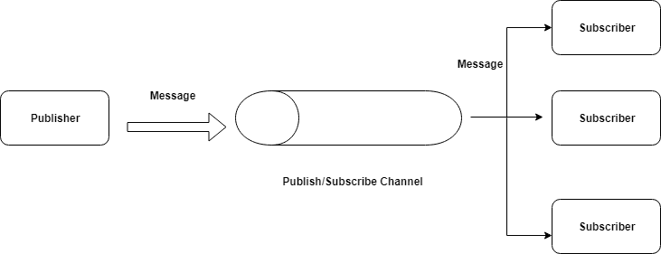

# <pre>                       **MESSAGING QUEUE**

# INTRODUCTION

    Messaging Queue is a storage for an asynchronous communication between different parts of a system.
    Those parts can also be referd as "Producers" and "Consumers".There are several producers(request for service) and several consumers(processes request). Messaging Queue provides storage for the request made by the producer and consumers fetch the message in a sequence of FIFO and process the request accordingly.

  

# TABLE OF CONTENT

  >-    Synchronous and Asynchronous communication.
  >-    Messaging Queue
  >-    Message Queue used models
  >-    Why Message queue is used

     

## 1. *Synchronous and Asynchronous communication*

    In order to understand MQ we first need to know what is "Synchronous and Asynchronous communication" ?
  - ###  Synchronous Communication-
      It is a communication when the producer and the consumer are in sync. 
      Means one who is requesting service(Producer) and the one who is receiving request(Consumer) are responding at the same instance. 
      Example- 
      Tow or more people communicating thrrough mobile phone.
  - ### Asynchronous communication-
      It is a communication in which the **Producer** and the **Consumer** do not necessarily need to be present at the same instance to respond to the request. 
      Example- 
      Text message send to a friend who is not connected to a network, but receives message when connected to the network.

## 2. *Messaging Queue*

  Messaging Queue allows different parts of a system(Producer and Consumer) to communicate Asynchronously.
  MQ is a sequential line of data block which has data structure  and memory to store request. These request are messages and this is called a message queue.Message queue acts as a medium to communicate between the parts of a system.

  Simply put, MQ is a storage where producer sends there request, that request is stored at the tail(End) of the queue and the condumer takes the messages from the head(Start) of the queue and process accordingly.
  

  **WORKING**
- Producer makes the request as messages.
- Those messages goes at the end of a queue as it is a FIFO storage device(Queue).
- Consumer fetches the message. 
- Each messsage is processed only once by a single consumer.
- And the request is carried out according to the message.

  

## 3. *Message Queue used models*
    There are two models in which message queues are used.
  - #### **One-To-One model.** 
  - #### **Pub/Sub model.** 
  1. One-To-One model- 
    In One-To-One model a single request is processed by a **_Single Customer_**. 
    If the number of request increses even then a single request is processed by a **_Single Customer_**. 
     
    Example- 
    Sending an e-mail to a friend.That e-mail is processed by a single consumer and only once.
  

    

  

  2. Pub/Sub model- 
    Pub/Sub model also known as Publish Subscriber model. 
    In this modle a single message is decoupled and a copy of message is send to **_many subscriber_** associciated to carry out different processes for the message fetched. 
     Example- 
    An order placed on an online shoping store. 
    The message is just the order. But there are many processes to be carried out. 
    Like- 
    Sending confirmation SMS, sending confirmation e-mail, the invoice message, etc.
     
    So for each processes in the message there are system called subscribers to carry out a single process out of many.

  

    

  

-  *The difference between the above two model is that, in case of One-To-One model there is a single consumer(subscriber) to process a single request.*

    *whereas in Pub/Sub model there are many subscriber to process different request in a single message*

## 4. *Why Message queue is used*

